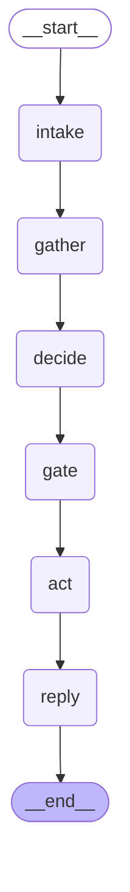

# Triage agent V1

Six nodes in a fixed order. The LLM runs in `decide` and `reply`; the other four are code.

```mermaid
---
config:
  flowchart:
    curve: linear
---
graph TD;
	__start__([<p>__start__</p>]):::first
	intake(intake)
	gather(gather)
	decide(decide)
	gate(gate)
	act(act)
	reply(reply)
	__end__([<p>__end__</p>]):::last
	__start__ --> intake;
	act --> reply;
	decide --> gate;
	gate --> act;
	gather --> decide;
	intake --> gather;
	reply --> __end__;
	classDef default fill:#f2f0ff,line-height:1.2
	classDef first fill-opacity:0
	classDef last fill:#bfb6fc
```
